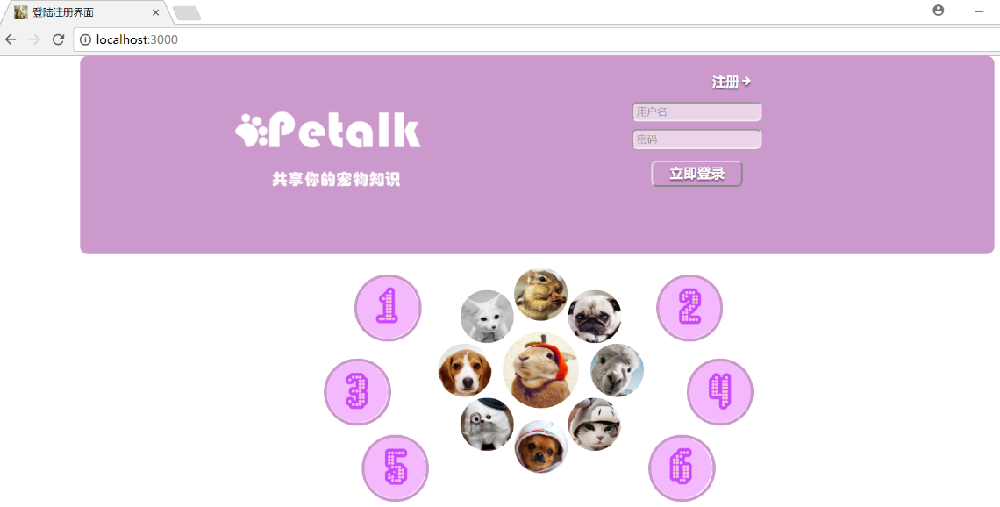

# Petalk-docker
A web for pet owners to Q&A.
 
Original project: https://github.com/Blanchedingding/ModernWeb

Running on docker with docker-compose

> Not upload the dependencies, download when build image petalk-service


```
cd Petalk-docker
docker-compose build
docker-compose up
```




(add videos under Petalk/public/video)

More details for this project: https://blog.csdn.net/Blanchedingding/article/details/80150448


 
